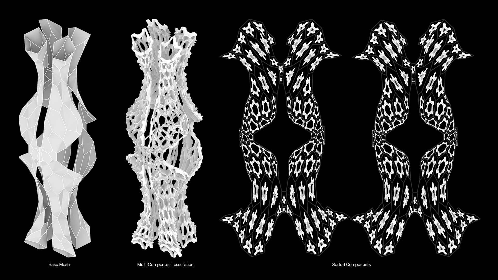

# Microbi Assembly Sequencer

Microbi Assembly Sequencer: A toolset for creating an assembly sequence of multi-part designs.

## DESCRIPTION
Microbi Assembly Sequencer is designed to help you create an assembly sequence of multi-part designs efficiently in Blender.

## COMPATIBILITY
This add-on is compatible with Blender 3.6.7 and later versions.

## INSTALLATION
1. Download the add-on zip file.
2. In Blender, go to `Edit > Preferences > Add-ons`.
3. Click `Install` and select the downloaded zip file.
4. Enable the add-on from the list.

## USAGE

### Prepare Base
1. **Set Seam (Edit Mode):**
    - Go to `Edit Mode` and select the edges where you want to set seams. These seams will be used for the UV unwrapping.
    - Click the `Set Seam` button.

2. **Clear Seam (Edit Mode):**
    - Go to `Edit Mode` and select the seams you want to clear. This is only necessary if you want to reset the seam and try a different UV unwrap.
    - Click the `Clear Seam` button.

3. **UV Unwrap:**
    - Go to `Object Mode` and select the mesh you want to unwrap.
    - Click the `UV Unwrap` button to create a 2D mesh layout while keeping the original mesh in place.

4. **Rotate 90°:**
    - Select the mesh you want to rotate.
    - Click the `Rotate 90°` button to rotate the mesh 90 degrees about its origin.

5. **Sort Faces:**
    - Select the mesh you want to sort based on the minimum spanning tree algorithm.
    - Click the `Sort Faces` button to sort the faces and create a visual representation.

6. **Show/Hide MST:**
    - Click the `Show/Hide MST` button to toggle the visibility of the Grease Pencil object that visualizes the MST.

### Prepare Components
1. **Create Loose Parts:**
    - Select the mesh with loose components.
    - Click the `Create Loose Parts` button to separate loose components into individual parts and reset their origins.

2. **Sort Components:**
    - Select the components you want to reorient based on the 2D mesh layout.
    - Click the `Sort Components` button to reorient the components from the 3D mesh to the 2D mesh layout.

### Utils
1. **Edge Naming:**
    - Select the mesh you want to label the edges.
    - Click the `Edge Naming` button to label the edges based on the operator logic.

2. **Face Text Size:**
    - Adjust the `Face Text Size` property to change the size of the text created for faces.

3. **Edge Text Size:**
    - Adjust the `Edge Text Size` property to change the size of the text created for edges.

### Select Component
1. **Select Component:**
    - Enter the name of the component you want to select in the `Component Name` field.
    - Click the `Select` button to select the component by its name.

## LICENSE
This program is free software: you can redistribute it and/or modify 
it under the terms of the GNU General Public License as published by 
the Free Software Foundation, either version 2 of the License, or
(at your option) any later version.

This program is distributed in the hope that it will be useful, 
but WITHOUT ANY WARRANTY; without even the implied warranty of
MERCHANTABILITY or FITNESS FOR A PARTICULAR PURPOSE. See the
GNU General Public License for more details.

You should have received a copy of the GNU General Public License
along with this program. If not, see <https://www.gnu.org/licenses/>.
